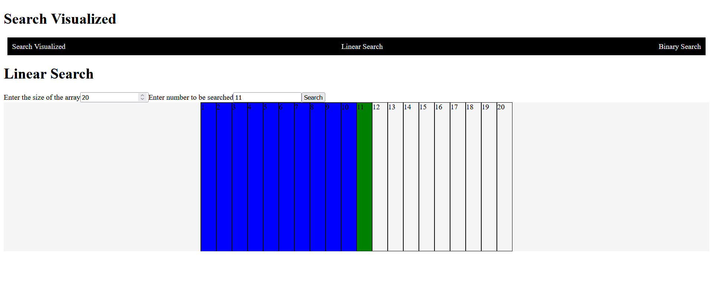

# Search Algorithm Visualization App

This app allows users to visualize and compare the performance of different search algorithms.

## Current Objectives

* Implement linear search algorithm visualization
* Implement binary search algorithm visualization

## Future Objectives

* Implement depth-first search (DFS) algorithm visualization
* Implement breadth-first search (BFS) algorithm visualization
* Implement jump search algorithm visualization
* Implement interpolation search algorithm visualization
* Implement exponential search algorithm visualization

## How to Use

    TODO: Add instructions for using the app

## Built With

* React

## To run the app locally

Start the project: `npm start`

Build the project: `npm run build`

Test the project: `npm test`
